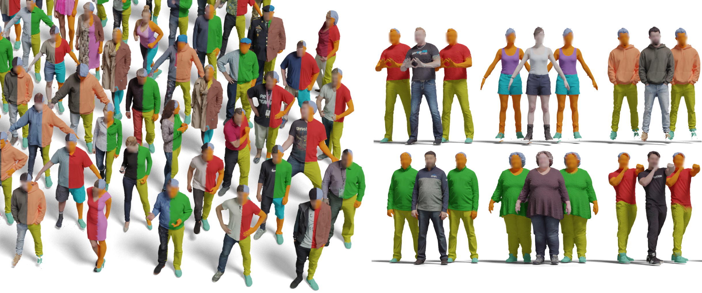

<!-- HEADER -->
<p align="center">
    <h1 align="center">CloSe: A 3D Clothing Segmentation Dataset and Model</h1>
    <!-- authors -->
    <p align="center">
        <a href="https://anticdimi.github.io/"><b>Dimitrije Antić</b></a>
        &emsp;
        <a href="https://virtualhumans.mpi-inf.mpg.de/people/Tiwari.html"><b>Garvita Tiwari</b></a>
        &emsp;
        <a href=""><b>Batuhan Ozcomlekci</b></a>
        &emsp;
        <a href="https://riccardomarin.github.io/"><b>Riccardo Marin</b></a>
        &emsp;
        <a href="https://virtualhumans.mpi-inf.mpg.de/people/pons-moll.html"><b>Gerard Pons-Moll</b></a>
    </p>
    <!-- conference -->
    <h3 align="center">3DV 2024</h3>
    <!-- teaser -->
    <p align="center">
        
    </p>
    <!-- badges -->
    <p align="center">
        <a href="https://arxiv.org/abs/2401.12051">
            
        </a>
        &emsp;
        <a href="https://virtualhumans.mpi-inf.mpg.de/close3dv24/">
            
        </a>
    </p>
</p>

## Environment Setup
The code was tested under `Ubuntu 22.04, Python 3.9, CUDA 11.6, Pytorch 1.13.0`\
Use the following command to create a conda environment with all the required dependencies:
```bash
conda env create -f env.yml
conda activate close
```
#### Note
If the environment setup fails, please follow instructions on how to install Pytorch3D [here](https://github.com/facebookresearch/pytorch3d/blob/main/INSTALL.md), and install PyTorch from [here](https://pytorch.org/get-started/locally/#linux-installation).

## CloSe-D Dataset
The steps for downloading the dataset are described in [docs/dataset.md](docs/dataset.md).

## CloSe-Net Clothing Segmentation Method
The pretrained models can be downloaded from [this link](https://nextcloud.mpi-klsb.mpg.de/index.php/s/TN9LDrM9YxQoXfA) in the folder `CloSeNet/`.
After downloading, place the models in the `./pretrained` folder.

### Inference
After setting up the environment and downloading the pretrained models, you can run the inference on the provided example scans using the following command:
```bash 
python demo.py --render
```
And the results will be saved in the `./out` folder.

### Training
Stay tuned for updates on training code and instructions.

## CloSe-T Interactive Tool
Stay tuned for updates on training code and instructions.

## Citation
If you find this work useful, please consider citing:
```bibtex
@inproceedings{antic2024close,
    title = {CloSe: A 3D Clothing Segmentation Dataset and Model},
    author = {Antic, Dimitrije and Tiwari, Garvita and Ozcomlekci, Batuhan  and Marin, Riccardo  and Pons-Moll, Gerard},
    booktitle = {International Conference on 3D Vision (3DV)},
    month = {March},
    year = {2024},
}
```